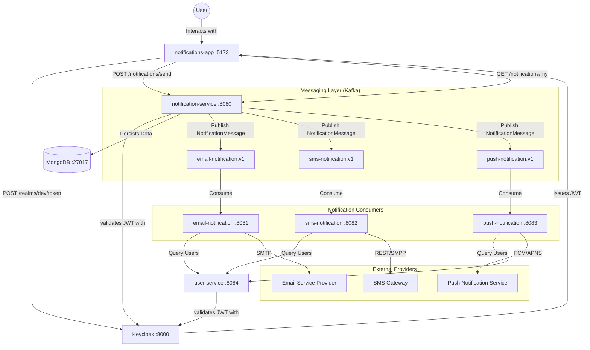
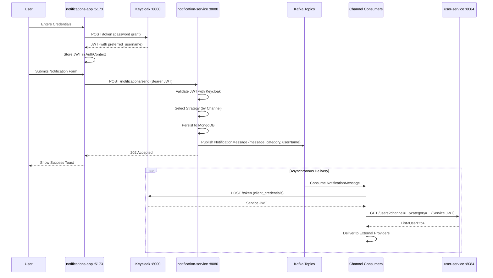
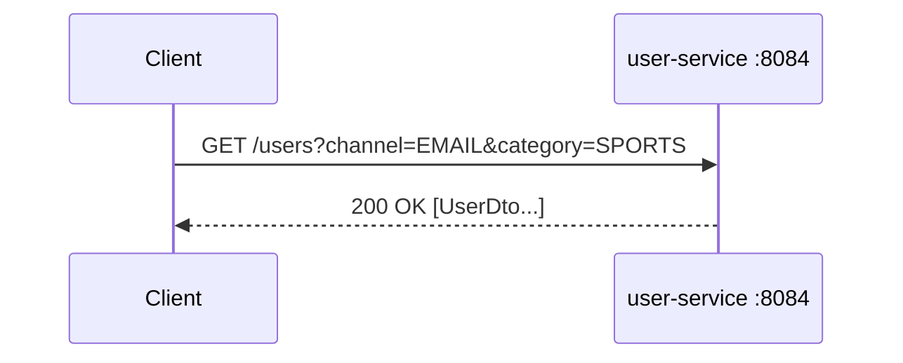

# 🏗️ System Architecture: Notification System

This document provides a technical deep-dive into the architectural design of the Notification System, explaining how various components interact to deliver messages across multiple channels via an event-driven approach.

---

## 🛰️ High-Level Component Diagram

The system architecture is centered around an **Event-Driven Core** with **Keycloak** managing identity and **MongoDB** handling persistence.

---

## 🔄 Notification Flow

---

## 🔄 User Query Flow

---

## 🛠️ Design Patterns

### 1. Strategy Pattern
The `NotificationService` acts as the context and selects the appropriate `NotificationStrategy` implementation based on the requested `Channel`.

- **Interface**: `NotificationStrategy`
- **Implementations**: `EmailNotificationStrategy`, `SmsNotificationStrategy`, `PushNotificationStrategy`
- Each strategy builds a `NotificationMessage` and publishes it to the corresponding Kafka topic.

### 2. Event-Driven (Producer-Consumer)
The `notification-service` is a **Kafka Producer**. The channel modules (`email-notification`, `sms-notification`, `push-notification`) act as **Kafka Consumers**, allowing fully asynchronous and decoupled delivery.

### 3. Configuration Properties
Kafka topic names are externalized via `@ConfigurationProperties` in `KafkaTopicProperties`, preventing hardcoded strings in strategy implementations.

---

## 💻 Frontend Architecture

The **notifications-app** is built using a modern React stack, designed to interact seamlessly with the event-driven backend.

### 1. State Management & Auth
- **React Context API**: Used for global state management, specifically for handling authentication status and user profile data.
- **JWT Handling**: Tokens are stored in memory/context and included in the `Authorization` header for all API requests.

### 2. Networking
- **Axios Interceptors**: Global interceptors handle token injection and respond to `401 Unauthorized` errors by redirecting users to the login page, ensuring a secure session lifecycle.

### 3. UI/UX
- **Material UI (MUI)**: Provides a consistent, responsive design system.
- **React Router**: Manages client-side routing, including protected routes that require authentication.

---

## 📨 Kafka Message Schema (`NotificationMessage`)

| Field | Type | Description |
| :--- | :--- | :--- |
| `message` | `String` | The notification body. |
| `category` | `NotificationCategory` | `SPORTS`, `FINANCE`, or `MOVIES`. |
| `userName` | `String` | The username of the authenticated publisher (from JWT `sub` claim). |

---

## 🔐 Security Architecture

The system implements a **Centralized Identity Provider** model using **Keycloak**:

1.  **Authorization Server (Keycloak)**: Issues JWTs via `password`, `authorization_code`, or `client_credentials` grants.
2.  **Resource Servers**: Both `notification-service` and `user-service` are Resource Servers that validate incoming JWTs against Keycloak's public keys.
3.  **Service-to-Service Auth**: Consumers use the `client_credentials` grant to obtain a system token, allowing them to query the `user-service` securely.
4.  **JWT Claims**: The system relies on the `preferred_username` claim to identify the subject.

---

## ☸️ Kubernetes Deployment

The system is designed to be deployed on **Kubernetes**, leveraging its orchestration capabilities for high availability and scalability.

| Service Name | Type | K8s Port | Local Port (Docker) | Responsibility |
| :--- | :--- | :--- | :--- | :--- |
| `keycloak-svc` | `LoadBalancer` | `8080` | `8000` | Central Identity Provider |
| `kafka-svc` | `ClusterIP` | `9092` | `9092` | Internal Message Broker |
| `mongodb-svc` | `ClusterIP` | `27017` | `27017` | Persistent Notification Store |
| `notifications-app` | `LoadBalancer` | `80` | `5173` | Frontend React Application |
| `notification-service` | `ClusterIP` | `8080` | `8080` | API Orchestrator & Kafka Producer |
| `user-service` | `ClusterIP` | `8080` | `8084` | User & Subscriber Metadata API |
| `email-consumer` | `ClusterIP` | `8080` | `8081` | Email Delivery Worker |
| `sms-consumer` | `ClusterIP` | `8080` | `8082` | SMS Delivery Worker |
| `push-consumer` | `ClusterIP` | `8080` | `8083` | Push Delivery Worker |

> [!NOTE]
> **Port Isolation**: In a Kubernetes environment, each Pod receives its own IP address, allowing all backend services to run on the standard internal port (`8080`) without conflict. During local development via Docker Compose, unique host ports are mapped to `localhost` to prevent collisions.

---

## 📈 Observability

- **Metrics**: Spring Boot Actuator enabled on all microservices for health checks and performance monitoring.
- **Persistence**: `notification-service` stores all accepted requests in **MongoDB** for audit trails and history.
- **Logging**: Log4j2 with structured logging, including MDC context for tracing request flow through Kafka.

---

## 🚀 Scalability & Next Steps

With the system running on Kubernetes, the following enhancements are recommended to optimize performance and resilience at scale:

### 1. K8s-Native Orchestration
- **Horizontal Pod Autoscaler (HPA)**: Automatically scale the number of pods for `notification-service` and `consumers` based on CPU/Memory usage or custom metrics.
- **Ingress Controller (Nginx / Traefik)**: Implement a unified entry point for the `notifications-app` and `notification-service` with SSL termination and path-based routing.
- **Helm Charts**: Standardize deployments using Helm for environment-specific configurations (Dev, Staging, Prod).
- **KEDA (Kubernetes Event-driven Autoscaling)**: Scale notification consumers dynamically based on the number of messages waiting in Kafka topics.

### 2. Data & Messaging Optimization
- **Kafka Concurrency & Partitioning**:
    - **Topic Partitioning**: Increase partition counts for high-traffic topics to allow more consumer instances to work in parallel within a consumer group.
    - **Consumer Concurrency**: Tune the `spring.kafka.consumer.concurrency` property (supported in the consumer modules) to allow a single pod to spin up multiple listener threads. This optimizes resource utilization by processing multiple partitions per pod, reducing the need for excessive horizontal pod scaling for high-partition topics.
- **MongoDB Optimization**:
  - **Migration Strategy**: Implement a migration strategy for MongoDB to handle schema changes and data migrations.
  - **Deployment Strategy**: Deploy MongoDB as a replica set for high availability and automatic failover.
  - **Backup & Restore**: Implement automated backup and restore procedures for MongoDB to ensure data durability and disaster recovery.
  - **Connection Pooling**: Configure connection pooling in the MongoDB driver to handle concurrent database operations efficiently.
  - **Read Preferences**: Configure read preferences to route read operations to secondary nodes for improved read scalability.
  - **MongoDB Indexing & Sharding**:
    - **Indexing Strategy**: Maintain compound indexes on frequently queried fields, such as `{creator: 1, id: 1}` for user-specific notification history and `{channel: 1, category: 1}` for high-performance filtering. These indexes ensure O(log n) search complexity as the notification store grows into millions of records.
    - **Sharding**: Implement sharding for the notifications collection to distribute write load and storage across multiple worker nodes, using a shard key that aligns with query patterns (e.g., `creator`).
- **Redis Caching**: Deploy a Redis cluster to cache subscriber preferences and session data, reducing latency for `user-service` lookups.

### 3. Resilience & Reliability
- **Circuit Breakers (Resilience4j)**: Protect services from cascading failures, especially during inter-service communication with `user-service`.
- **Dead Letter Queues (DLQ)**: Ensure that failed delivery attempts are routed to a separate Kafka topic for retry or manual intervention.

### 4. Advanced Observability
- **Service Mesh (Istio / Linkerd)**: Implement a service mesh for advanced traffic management, mTLS security, and deep observability between services.
- **Prometheus & Grafana**: Set up comprehensive monitoring for K8s cluster health and application-level metrics (e.g., Kafka lag, notification throughput).
- **Distributed Tracing (Jaeger)**: Trace requests as they move from the React frontend through the orchestrator into Kafka and out through the consumers.

---

